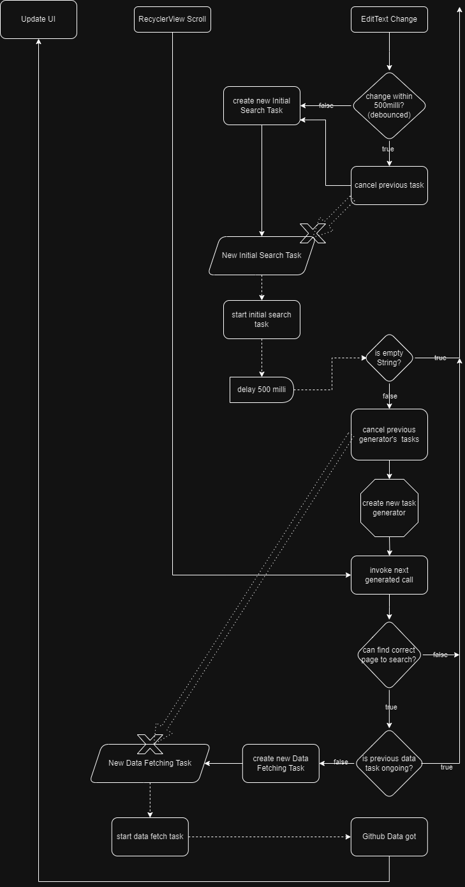

# GithubAPISample

能搜尋Github Repository的Android Native App

## Table of Contents

- MVVM architecture
- input text change searching(using debounced technique)
- Infinite Scrolling(也有實現刪除過遠資料邏輯，實現真正infinite scrolling)
- task conflict solving
- DI using Koin
- UI Test
- Unit Test
- Coroutine
- Retrofit

## Installation

可以直接在Android手機上安裝根目錄的apk檔案

## Usage

如果您想要閱讀此程式碼，您可以直接clone此repository並切換到master branch

## App Structure

## App Logic Flow

